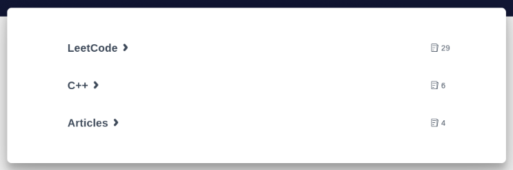

# 基于`Hexo`的Fluid主题博客

## 前置依赖

1. `node.js`
2. `hexo`
3. `yarn`


## 写博客

1. 文章需要用markdown格式

2. 博客文章需要放在`source/_posts/`文件夹下。

3. 在分类页面下，文件夹是递归显示的。

4. 如果存在文件夹内，则会出现在**分类**页面下，否则仅仅出现在首页和归档下。假如我的目录是

   ```shell
   source/_posts/
                   ├── hello.md #hello.md 这篇文章不会显示在分类页面显示（主页和检索还是能检索到）
                   ├── Articles #文件下省略文章显示
                   ├── C++
                   └── LeetCode
                       ├── Dynamic Programming
                       ...
   ```

   分类页面就是这样的，打开LeetCode还可以看到Dynamic Programming目录下的文章。

     


## 启动

**本地启动**服务

```shell
yarn s # yarn s是自定义命令 "s": "hexo clean ; hexo generate ; hexo s",

# 会出现如下字样，通过提示的url能看到页面
# INFO  Hexo is running at http://localhost:4000/ . Press Ctrl+C to stop.
```

部署到博客网站

```shell
yarn d # yarn d是自定义命令 "d": "hexo clean ; hexo generate ; hexo d",
```


## tips

> 本文作者操作手册，读者可视情况参考

- 先下载前置依赖

- 软链接笔记目录：`ln -s ${note_path}/public source/_posts`

  使用该命令（Linux、Mac OS下），将笔记目录创建软链接，到`source/_posts/`目录下，避免手动迁移。

- `yarn d`部署


## 定制

>  定制命令、主题、首页标语、配置等


### 自定义命令

见`package.json`文件

```shell
"c": "git add . ; git commit -m \"auto\"",
"p": "yarn c ; git push",
"s": "hexo clean ; hexo generate ; hexo s",
"d": "hexo clean ; hexo generate ; hexo d",
"backup": "yarn c ; yarn p",
"cs": "yarn c ; yarn s",
"pd": "yarn p ; yarn d",
"total": "yarn c ; yarn pd"
```


### 插件

1. 生成目录插件：`"hexo-enhancer": "^1.0.10",`

2. 图片插件：`"hexo-image-link": "^0.0.6",`， 并设置 `post_asset_folder: true`。但这种方式只能在同名文件夹下，

   ```shell
   # 目录结构
   .
   ├── hao
   │   └── img.png
   └── hao.md
   
   # markdown 中 image引用方式
   
   ```

   没法用其他名字，例如所有笔记，统一放在assert中，这是不行的（找了半天都没找到开发好的插件，可以通过拷贝图片到对应目录解决）。

   ```shell
   # hao和hao2的文件都放在assts中，虽然在本地typora中可见，但hexo并不会正确处理图片，博客网站中无法显示。
   .
   ├── assets
   │   └── img.png
   ├── hao.md
   └── hao2.md
   ```

   

 

### 配置

配置文件在根目录下的`_config.yml`中。


### 主题

要修改主题，只需将主题repo clone到`themes/`下，并修改根目录下的`_config.yml`文件的`theme`选项, 在根目录下添加主题对应的配置文件（一般在主题官网会告知配置方式）。


**以fluid为例**

我现在用的是[fluid](https://github.com/fluid-dev/hexo-theme-fluid)主题, 目录为`themes/fluid/`

配置文件在根目录下，为`_config.fluid.xml`。

自定义部分，修改配置文件`themes/fluid/_config.yml` 

- 左侧title（目前为`Epoch`）：文件中的 `blog_title: "Epoch"`部分
- 首页slogan的文本（目前为`Hi~, here is Jiahao. `）：修改文件中的` slogan`的`text: "Hi~, here is Jiahao. "`部分

