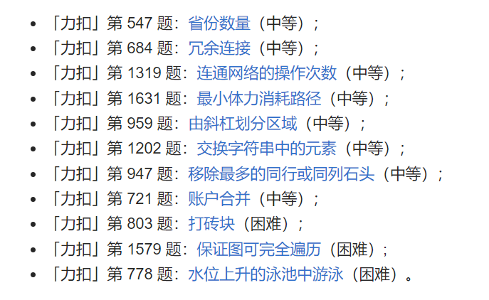

## 大类
* 有向图
* 无向图
* 加权图
  

### 有向图
> 考虑入度和出度。
* [841. 钥匙和房间](https://leetcode-cn.com/problems/keys-and-rooms/)
* [997. 找到小镇的法官](https://leetcode-cn.com/problems/find-the-town-judge/)
* [1557. 可以到达所有点的最少点数目](https://leetcode-cn.com/problems/minimum-number-of-vertices-to-reach-all-nodes/submissions/)

### 拓扑排序
* [207. 课程表](https://leetcode-cn.com/problems/course-schedule/)

* [210. 课程表 II](https://leetcode-cn.com/problems/course-schedule-ii/)

* [851. 喧闹和富有](https://leetcode-cn.com/problems/loud-and-rich/)

* [802. 找到最终的安全状态](https://leetcode-cn.com/problems/find-eventual-safe-states/)

* [310. 最小高度树](https://leetcode-cn.com/problems/minimum-height-trees/)

* #### [444. 序列重建](https://leetcode.cn/problems/sequence-reconstruction/)

* [1557. Minimum Number of Vertices to Reach All Nodes](https://leetcode.cn/problems/minimum-number-of-vertices-to-reach-all-nodes/)

## 最小生成树

> 有向无环图

> Prim Kruskal 考虑权值最小的边
> |Prim|Kruskal|
> |-|-|
> |从点出发|从边出发|
### Prim

* [1135. 最低成本联通所有城市](https://leetcode-cn.com/problems/connecting-cities-with-minimum-cost/)

### Kruskal

* [1631. 最小体力消耗路径](https://leetcode-cn.com/problems/path-with-minimum-effort/)
* [778. 水位上升的泳池中游泳](https://leetcode-cn.com/problems/swim-in-rising-water/)

## 最短路径问题

模板题：[743. 网络延迟时间](https://leetcode-cn.com/problems/network-delay-time/)

`n` 为顶点个数， `E`为边个数

|图|单源\多源|负权边|负权环|时间复杂度|空间|
|-|-|-|-|:-:|-|
|Dijkstra|单源|不适用|不适用|$O(n^2 + E)$|$O(n^2)$|
| Dijkstra（堆优化） | 单源      | 不适用 | 不适用 | $O(n + E\log{E})$ | $O(n + E)$ |
| Bellman-Ford        | 单源      | 适用   | 适用   |      $O(nE)$      | $O(E)$     |
| SPFA（栈\队列优化） | 单源      | 适用   | 适用   |     $O(k*E)$      | $O(E)$     |
| Floyd               | 多源      | 适用   | 不适用 |     $O(n^3)$      | $O(n^2)$   |
| A star |  |  |  |  |  |

### Dijkstra

>  每次选取距离起点最近的点，选取之后更新各点的最短距离。
>
>  Dijkstra不适用于负权边,因为不考虑已经走过的地方。
>
>  优化：最小堆

#### 堆优化Dijkstra

> 用priority_queue<>存储边， $O(\log(n)$时间内获取最小权边

*  [2045. 到达目的地的第二短时间](https://leetcode-cn.com/problems/second-minimum-time-to-reach-destination/)
*  [1786. 从第一个节点出发到最后一个节点的受限路径数](https://leetcode-cn.com/problems/number-of-restricted-paths-from-first-to-last-node/)

##### 相关参数

* `priority_queue<> minHeap`  存边和点，每次取权值最小的边。
* `dist[n]` 最短路径
* 起点`start`, 终点`target`

##### 实现思路

* `dist[start] = 0`,同时`minHeap` 入队起点，边权值设为`0`

##### 易错点

* 注意设置每次更新`dist[i]`都要将`dist[i]`和`i`入队，因为可能比`minHeap`中该点（但该点未`visited`）的`dist`要更小。

##### 题外话

`Dijkstra(堆优化)`跟`Prim`算法很像，都是取`dist`最小的边。

区别在于， 前者的`dist`是最短距离，后者存的是一条边的权重。

因为`Prim`是把已经成树的点看作一个整体，只要看一条边的权重即可。

##### 扩展

* [1162. 地图分析](https://leetcode-cn.com/problems/as-far-from-land-as-possible/) 多源最短路。二维表

### Bellman-Ford
遍历边来relax，对于不含负权环的图来说，遍历n-1次一定能设置好最短路径。

适用负权环

* [1334. 阈值距离内邻居最少的城市](https://leetcode-cn.com/problems/find-the-city-with-the-smallest-number-of-neighbors-at-a-threshold-distance/)
* [787. K 站中转内最便宜的航班](https://leetcode-cn.com/problems/cheapest-flights-within-k-stops/)
* [1129. Shortest Path with Alternating Colors](https://leetcode.cn/problems/shortest-path-with-alternating-colors/)

#### 检测负环

1. 只需对第n次检查是否relax了`dist`数组就能判断是否含负权环。

### Bellman-Ford优化：SPFA

DFS(Stack) / BFS (Queue)

建议使用BFS(Queue)优化的SPFA,  无负环时不影响效率。

#### 实现思路

* `bool inQueue[]`表示点是否在Q里头
* `dist[]`距离
* 将起点入队，同时`inQueue[start] = true`
* 取队首元素为`cur`，同时设置`inQueue[cur] = false`
* 更新与`cur`相邻的`dist[]`，如果邻点`inQueue[] = false`， 则将其入队，且设置`inQueue[] = true`， 一入队就更新`inQueue`防止重复入队。
* 重复上述步骤，直至`Q.empty == true`，至此`dist`数组更新完毕。

#### 检测负环

1. 用一个`cnt[]`来记录入队次数，如果入队次数大于n，就说明有负环。
2. 用一个`cnt[]`来记录从起点到`i`的最短距离包含点的个数， 初始化`cnt[] = 1`, 用点`u`松弛`v`时更新`cnt[v] = cnt[u] + 1` ， 若发现`cnt[v] > n`则存在负环

### Floyd

> 基于DP，因此K放外层循环。

> 对于i，j两点。用k点检查是否缩短该两点距离
>
> Floyd适用负权边，因为三重循环，一直寻找最短。
>
> Dijkstra、Bellman-Ford都不适用负权环。

### 总结

* 注意判断是否是有向图。
* 注意有限制的最短路，不同的方法，不同优化对应不同场景。
  * 当权值为非负时，用Dijkstra。
  * 可能有负权环，用BFS-Bellman-Ford，`cnt[]`检测入队次数。

* Bellman_Ford 可解决有中转次数的最短路问题。
* Floyd 适用于经过的所有点编号不会超过k的问题。_最小环或者求“重心点”（即删除该点后，最短路值会变大）。_

## 深度优先搜索

> 常辅以记忆化递归（memo）
>
> 对于图，一般需要一个visited数组来防止重复递归。如果图的元素限制了递归，就可能不需要。
>
> 对于需要返回值来提前结束递归或者积累子问题的结果，我们需要设置返回值，其他一般为void，获取全部可能。
>
> 回溯问题一般在函数前面部分处理递归出口，其他一般在循环中判断是否进入递归，这样更具有自由度：一个返回值所含信息有限，无法处理所有情况。实际上，返回值和递归入口出口的设置很灵活，难以总结。
>
> 树的DFS中，只能向下。但如果有parent数组记录，则可向上，但DFS时需要多一个from参数防止重复递归。

* [200. 岛屿数量](https://leetcode-cn.com/problems/number-of-islands/)

* [LCP 07. 传递信息](https://leetcode-cn.com/problems/chuan-di-xin-xi/)

* [863. 二叉树中所有距离为 K 的结点](https://leetcode-cn.com/problems/all-nodes-distance-k-in-binary-tree/) 

*  [62. 不同路径](https://leetcode-cn.com/problems/unique-paths/)

* [63. 不同路径 II](https://leetcode-cn.com/problems/unique-paths-ii/)

*  [980. 不同路径 III](https://leetcode-cn.com/problems/unique-paths-iii/)

### 返回值做子问题的累计

* [329. 矩阵中的最长递增路径](https://leetcode-cn.com/problems/longest-increasing-path-in-a-matrix/)
* [2049. 统计最高分的节点数目](https://leetcode-cn.com/problems/count-nodes-with-the-highest-score/)

### 返回值做提前结束递归

* [403. 青蛙过河](https://leetcode-cn.com/problems/frog-jump/)
* [785. 判断二分图](https://leetcode-cn.com/problems/is-graph-bipartite/)

### 返回值告知整体情况

> 这种情况，在循环内限制递归入口不能实现理想效果或实现复杂。

* [1020. 飞地的数量](https://leetcode-cn.com/problems/number-of-enclaves/)

### 循环内限制递归入口

* [1034. 边界着色](https://leetcode-cn.com/problems/coloring-a-border/)

## 广度优先搜索

> 注意最大、最小次数、最短距离等字眼，可以考虑BFS。

### 大致思路

#### 相关参数
* `visited`防止重复搜索。如果是有向图，就可以不用。
* `queue` 用于存储待搜索的节点
* `dirs`搜索方向，`level`搜索深度,`size`每一层搜索的节点个数。
#### 实现

* 将当前状态入队，根据搜索规则将下一轮的状态入队。`queue `不一定是队列，只要是存现在的状态就行，如哈希表。
* `visited`的具体实现可以是数组，也可以是哈希表。
* 队空搜索完成。

### 易错
不同于`Prim`和`priority_queue Dijkstra`， BFS是加入`queue`时就设置`visited`，防止重复入`queue`。

* [130. 被围绕的区域](https://leetcode-cn.com/problems/surrounded-regions/)

* [200. 岛屿数量](https://leetcode-cn.com/problems/number-of-islands/)

* [547. 省份数量](https://leetcode-cn.com/problems/number-of-provinces/)

* [1091. 二进制矩阵中的最短路径](https://leetcode-cn.com/problems/shortest-path-in-binary-matrix/)

* [1020. 飞地的数量](https://leetcode-cn.com/problems/number-of-enclaves/)

* [1034. 边界着色](https://leetcode-cn.com/problems/coloring-a-border/)

* [2039. 网络空闲的时刻](https://leetcode-cn.com/problems/the-time-when-the-network-becomes-idle/)

* [909. 蛇梯棋](https://leetcode-cn.com/problems/snakes-and-ladders/)

* [433. 最小基因变化](https://leetcode.cn/problems/minimum-genetic-mutation/)

* [994. 腐烂的橘子](https://leetcode-cn.com/problems/rotting-oranges/) 多源BFS

* [417. Pacific Atlantic Water Flow](https://leetcode.cn/problems/pacific-atlantic-water-flow/) 多次BFS

* [1765. 地图中的最高点](https://leetcode-cn.com/problems/map-of-highest-peak/) (多源BFS) DP

* [1162. 地图分析](https://leetcode-cn.com/problems/as-far-from-land-as-possible/) （多源BFS）

* [752. 打开转盘锁](https://leetcode-cn.com/problems/open-the-lock/) (哈希`visited`)

* [301. 删除无效的括号](https://leetcode-cn.com/problems/remove-invalid-parentheses/submissions/)

* [773. 滑动谜题](https://leetcode-cn.com/problems/sliding-puzzle/)

### 扩展

> 双向BFS
>
> 有限次数BFS

* [2059. 转化数字的最小运算数](https://leetcode-cn.com/problems/minimum-operations-to-convert-number/)

* [127. 单词接龙](https://leetcode-cn.com/problems/word-ladder/)

* [1345. 跳跃游戏 IV](https://leetcode-cn.com/problems/jump-game-iv/)
> 由于BFS搜索的状态增加是指数级别的，条件允许可以考虑双向BFS。

* [1036. 逃离大迷宫](https://leetcode-cn.com/problems/escape-a-large-maze/)
> 数据量很大，考虑有限次数的BFS。

* [815. 公交路线](https://leetcode-cn.com/problems/bus-routes/)

## 并查集 Disjoint-set structure

> 将二维下标转化为一维下的通常需要 `index = i * col + j`转化

* [547. 省份数量](https://leetcode-cn.com/problems/number-of-provinces/)
* [200. 岛屿数量](https://leetcode-cn.com/problems/number-of-islands/)
* [130. 被围绕的区域](https://leetcode-cn.com/problems/surrounded-regions/)
* [685. 冗余连接 II](https://leetcode-cn.com/problems/redundant-connection/)
* [778. 水位上升的泳池中游泳](https://leetcode-cn.com/problems/swim-in-rising-water/)
* [399. 除法求值](https://leetcode-cn.com/problems/evaluate-division/)
* [785. Is Graph Bipartite?](https://leetcode.cn/problems/is-graph-bipartite/)
* [886. Possible Bipartition](https://leetcode.cn/problems/possible-bipartition/)

## 其他

> 不好分类

* [407. 接雨水 II](https://leetcode-cn.com/problems/trapping-rain-water-ii/)
* [399. 除法求值](https://leetcode-cn.com/problems/evaluate-division/)

